# OpsGuardian™

<div align="center">

[](LICENSE)
[](https://developer.salesforce.com)
[](.github/workflows)
[](.)

**Enterprise-grade Salesforce monitoring and compliance framework**

[Features](#features) • [Installation](#installation) • [Quick Start](#quick-start) • [Documentation](#documentation) • [Support](#support)

</div>

---

## Overview

OpsGuardian™ is a comprehensive Salesforce-native monitoring and compliance framework designed for regulated industries. It provides real-time observability, AI-powered diagnostics, and automated remediation to help organizations maintain compliance, prevent outages, and scale securely.

### Why OpsGuardian?

- **Real-Time Monitoring**: Track governor limits, Flow execution, API usage, and system performance
- **AI-Powered Insights**: Leverage Einstein and external LLMs for intelligent diagnostics
- **Compliance-Ready**: Built for GDPR, SOC 2, HIPAA with Shield Platform Encryption
- **Enterprise Scale**: Hub-and-spoke architecture for multi-org telemetry aggregation
- **Extensible**: Plugin SDK for Slack, Jira, webhooks, and custom integrations

---

## Features

### 🔍 Observability

- **Governor Limit Monitoring**: Real-time tracking of CPU time, heap size, SOQL/DML limits
- **Flow Execution Tracking**: Monitor Flow runs, detect faults, analyze performance
- **API Usage Analytics**: Track API consumption and predict exhaustion
- **Deployment Monitoring**: Track deployment jobs, test results, and deployment metrics

### 🤖 AI Diagnostics

- Einstein Prediction Builder integration
- External LLM support (GPT, Claude, etc.) via Named Credentials
- Automated root cause analysis
- Smart remediation recommendations

### 🛡️ Security & Compliance

- **Shield Platform Encryption**: Encrypt data at rest
- **CRUD/FLS Enforcement**: `WITH SECURITY_ENFORCED` on all queries
- **Audit Trails**: Tamper-evident logs with correlation IDs
- **Data Retention**: Configurable retention policies (default 180 days)
- **Multi-Org Isolation**: Segregated data access per organization

### 🔔 Alerting & Automation

- **Platform Events**: Real-time event streaming
- **Multi-Channel Alerts**: Slack, Jira, webhooks, custom integrations
- **Automated Remediation**: Trigger Flows or custom Apex on threshold breaches
- **Escalation Policies**: Configurable alert routing and escalation

### 📊 Dashboards

- **Lightning Web Components**: Modern, responsive UI tiles
- **Real-Time Data**: Auto-refreshing dashboards with visibility state management
- **Performance Optimized**: LDS caching, exponential backoff, efficient polling

---

## Tech Stack

| Component | Technology |
|-----------|-----------|
| **Platform** | Salesforce (Lightning, Apex, LWC) |
| **Package Type** | Second-Generation Managed Package (2GP) |
| **API Version** | 62.0+ |
| **AI Integration** | Einstein + External LLMs (OAuth JWT) |
| **Security** | Shield Platform Encryption, CRUD/FLS enforcement |
| **Integrations** | Platform Events, REST APIs, Named Credentials |
| **DevOps** | Salesforce CLI, GitHub Actions, ESLint, Prettier |
| **Testing** | Apex Tests (95%+ coverage), Jest for LWC |

---

## Architecture

```mermaid
flowchart TB
    subgraph "Salesforce Org"
        LWC[OpsGuardian LWC]
        APEX[Apex Services]
        DATA[(OpsGuardian Data)]
        EVENTS[Platform Events]
        CMDT[Custom Metadata]

        LWC --> APEX
        APEX --> DATA
        APEX --> EVENTS
        APEX --> CMDT
    end

    subgraph "External Systems"
        AI[AI Services]
        SLACK[Slack]
        JIRA[Jira]
        ORGS[Other Orgs]
    end

    APEX -->|Named Credential| AI
    EVENTS --> SLACK
    EVENTS --> JIRA
    APEX -->|REST API| ORGS

    style LWC fill:#1798c1
    style APEX fill:#00a1e0
    style DATA fill:#032d60
    style EVENTS fill:#ea8e1e
```



### Key Components

1. **OpsGuardian LWC Tiles**: Real-time dashboard components
2. **Apex Services**: Core business logic, API integrations
3. **Custom Objects**: `OpsGuardian_History__c`, `Flow_Execution__c`, `API_Usage_Snapshot__c`
4. **Platform Events**: `Performance_Alert__e` for real-time alerting
5. **Custom Metadata**: `OG_Policy__mdt` for configurable thresholds

---

## Installation

### Prerequisites

- Salesforce CLI (`sf` or `sfdx`)
- Dev Hub enabled
- Node.js 18+ (for local development)

### Option 1: Scratch Org (Development)

```bash
# Authenticate to your Dev Hub
sf org login web --set-default-dev-hub --alias DevHub

# Create scratch org
sf org create scratch --definition-file config/project-scratch-def.json \
  --alias OpsGuardian --duration-days 7 --set-default

# Push source
sf project deploy start

# Assign permission set
sf org assign permset --name OpsGuardian_Admin

# Open org
sf org open --path /lightning/app/OpsGuardian
```

### Option 2: Sandbox/Production

1. Install the managed package:
   ```
   https://login.salesforce.com/packaging/installPackage.apexp?p0=04t...
   ```

2. Assign the `OpsGuardian_Admin` permission set to administrators

3. Configure thresholds in Setup → Custom Metadata Types → `OG_Policy__mdt`

4. (Optional) Configure Named Credentials for AI integration and external webhooks

---

## Quick Start

### 1. Configure Policies

Navigate to **Setup → Custom Metadata Types → OG Policy** and create threshold policies:

| Field | Example Value | Description |
|-------|--------------|-------------|
| CPU_Warn__c | 5000 | CPU time warning (ms) |
| CPU_Crit__c | 8000 | CPU time critical (ms) |
| SOQL_Warn__c | 80 | SOQL query warning |
| SOQL_Crit__c | 95 | SOQL query critical |

### 2. Set Up Alerting

Configure Slack webhook:

1. **Setup → Named Credentials → New**
2. Create `Slack_Webhook` with your Slack webhook URL
3. Test with: `SlackNotifier.notifyAsync('Test message')`

### 3. View Dashboards

Open the **OpsGuardian** Lightning app to access:

- API Usage Dashboard
- Flow Execution Monitor
- System Performance Dashboard
- Deployment Monitor
- Performance Alert Panel

### 4. Monitor Events

Query operational events:

```sql
SELECT Event_Type__c, Severity__c, Message__c, Timestamp__c
FROM OpsGuardian_History__c
WHERE Severity__c = 'Critical'
ORDER BY Timestamp__c DESC
LIMIT 50
```

---

## Configuration

### Custom Metadata (Policies)

Configure monitoring thresholds via **OG_Policy__mdt**:

```apex
// Example: Get current settings
CCX_Settings__c settings = CCX_Settings__c.getInstance();
Integer cpuWarn = settings.CPU_Warn__c?.intValue();
```

### Named Credentials (AI Integration)

1. **Setup → Named Credentials → External Credentials**
2. Create `OG_AI` with JWT Bearer flow
3. Configure endpoint URL for your AI service
4. Assign principal to `OpsGuardian_Admin` permission set

### Platform Events

Subscribe to `Performance_Alert__e` for real-time alerts:

```apex
trigger PerformanceAlertTrigger on Performance_Alert__e (after insert) {
    for (Performance_Alert__e evt : Trigger.new) {
        if (evt.Severity__c == 'Critical') {
            SlackNotifier.notifyPerformanceEvent(evt);
        }
    }
}
```

---

## API Reference

### Ingest API (Hub-and-Spoke)

Send telemetry from spoke orgs to a central hub:

**Endpoint**: `/services/apexrest/og/v1/ingest`

**Method**: `POST`

**Authentication**: JWT Bearer token

**Request Body**:
```json
{
  "type": "CPU",
  "message": "CPU limit breach in after-insert trigger",
  "severity": "Critical",
  "timestamp": "2025-01-15T10:30:00Z",
  "correlationId": "a1b2c3d4"
}
```

**Example**:
```bash
curl -X POST "$SF_URL/services/apexrest/og/v1/ingest" \
  -H "Authorization: Bearer $JWT" \
  -H "Content-Type: application/json" \
  -d '{
    "type": "CPU",
    "message": "CPU limit exceeded",
    "severity": "Critical",
    "timestamp": "2025-01-15T10:30:00Z"
  }'
```

**Responses**:
- `201 Created`: Event ingested successfully
- `400 Bad Request`: Invalid payload
- `401 Unauthorized`: Invalid or missing JWT
- `429 Too Many Requests`: Rate limit exceeded (includes `Retry-After` header)

---

## Plugin SDK

Extend OpsGuardian with custom integrations:

### Plugin Interface

```apex
public interface OG_Plugin {
    void send(OpsGuardian_History__c eventRec);
    Boolean supports(String eventType, String severity);
}
```

### Example Plugin

```apex
public class MyCustomPlugin implements OG_Plugin {
    public void send(OpsGuardian_History__c eventRec) {
        // Send to external system
        HttpRequest req = new HttpRequest();
        req.setEndpoint('callout:MyWebhook');
        req.setMethod('POST');
        req.setBody(JSON.serialize(eventRec));
        new Http().send(req);
    }

    public Boolean supports(String eventType, String severity) {
        return severity == 'Critical';
    }
}
```

### Register Plugin

1. Create Custom Metadata record: `OG_Plugin_Config__mdt`
2. Set `Class_Name__c` to `MyCustomPlugin`
3. Configure filters (event types, severities)

---

## Development

### Local Setup

```bash
# Clone repository
git clone https://github.com/derickporter1993/Ops-Guardian.git
cd Ops-Guardian

# Install dependencies
npm install

# Run tests
npm test

# Lint & format
npm run lint
npm run fmt
```

### Running Tests

```bash
# Apex tests
sf apex run test --test-level RunLocalTests --code-coverage --result-format human

# LWC tests (if configured)
npm run test:unit

# Static analysis
sf scanner run --target force-app --format table
```

### Code Quality

- **ESLint**: Configured with `@lwc/eslint-plugin-lwc` and Babel parser
- **Prettier**: Auto-formatting for JS, HTML, JSON, YAML, Markdown
- **Salesforce Code Analyzer**: PMD + security rules
- **Coverage Target**: 95%+ for Apex

---

## Security

### Threat Model

OpsGuardian follows security best practices:

| Threat | Mitigation |
|--------|-----------|
| **Spoofing** | JWT validation, audience checks |
| **Tampering** | `WITH SECURITY_ENFORCED`, `Security.stripInaccessible()` |
| **Repudiation** | Append-only logs with correlation IDs |
| **Information Disclosure** | CRUD/FLS enforcement, Shield encryption |
| **DoS** | Rate limiting (429 responses), Platform Cache |
| **Elevation of Privilege** | Least-privilege permission sets, `with sharing` |

### Data Privacy

- **Encryption**: Shield Platform Encryption at rest, TLS 1.3 in transit
- **Retention**: Default 180 days, configurable per policy
- **Erasure**: Admin-initiated deletion via Flow, batch anonymization
- **Compliance**: GDPR, SOC 2, HIPAA-ready patterns

### Reporting Vulnerabilities

Report security issues via [GitHub Security Advisories](https://github.com/derickporter1993/Ops-Guardian/security/advisories).

**Do not file public issues for security vulnerabilities.**

---

## Performance

### Benchmarks

| Scenario | P50 | P95 | Notes |
|----------|-----|-----|-------|
| Ingest API (per request) | 90ms | 180ms | Queueable insert |
| Dashboard refresh | 600ms | 1200ms | Indexed queries + LDS cache |
| Risk scoring (1K records) | 120ms | 250ms | Heuristic baseline |

**Test Environment**: Enterprise Edition, ~1M history records, ~10K events/hour

### Optimization Tips

- Set dashboard refresh to 60-120 seconds
- Run batch compaction jobs nightly
- Configure environment-specific CMDT thresholds
- Use selective SOQL queries with indexes
- Enable LDS caching for LWC components

---

## Troubleshooting

### Common Issues

#### Charts are blank
**Solution**: Upload Chart.js static resource and clear app cache

#### FLS/DML exceptions during ingest
**Solution**: Verify `OpsGuardian_Admin` field-level permissions; confirm `Security.stripInaccessible()` is deployed

#### 429 responses from ingest
**Solution**: Org is rate-limited; inspect Platform Cache keys (`rl:*`); lower event volume or increase quota

#### Einstein scoring not showing
**Solution**: Enable Prediction Builder model and grant user permission set license

#### LWC components not loading
**Solution**: Check browser console for errors; verify API version 62.0+; clear Lightning cache

---

## Roadmap

- [ ] AppExchange listing
- [ ] Multi-language support (Spanish, French, German)
- [ ] Advanced ML anomaly detection
- [ ] Mobile app (Salesforce Mobile SDK)
- [ ] Grafana/Datadog integration
- [ ] Custom report builder

---

## Contributing

We welcome contributions! Please see [CONTRIBUTING.md](CONTRIBUTING.md) for guidelines.

### Development Workflow

1. Fork the repository
2. Create a feature branch (`git checkout -b feature/amazing-feature`)
3. Make your changes
4. Run tests and linting
5. Commit with clear messages (`git commit -m 'feat: add amazing feature'`)
6. Push to your fork
7. Open a Pull Request

---

## Support

### Documentation

- [Architecture Guide](docs/architecture.md)
- [API Reference](docs/api-reference.md)
- [Security Guide](docs/security.md)
- [Compliance](docs/compliance/)
- [Operations Runbook](docs/operations.md)

### Getting Help

- 📖 [Documentation](docs/)
- 💬 [Discussions](https://github.com/derickporter1993/Ops-Guardian/discussions)
- 🐛 [Issue Tracker](https://github.com/derickporter1993/Ops-Guardian/issues)
- 📧 Email: [SUPPORT.md](SUPPORT.md)

### Community

- Star ⭐ the repo to show support
- Follow for updates
- Share your use cases and feedback

---

## License

MIT License - see [LICENSE](LICENSE) for details.

Copyright (c) 2025 Derick Porter

---

## Acknowledgments

Built with ❤️ for the Salesforce community.

Special thanks to:
- Salesforce Platform team
- Lightning Web Components team
- All contributors and early adopters

---

<div align="center">

**[⬆ back to top](#opsguardian)**

Made with Salesforce ☁️

</div>
